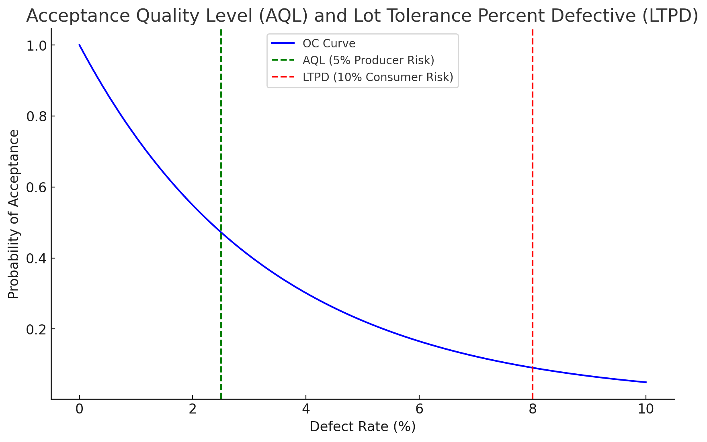
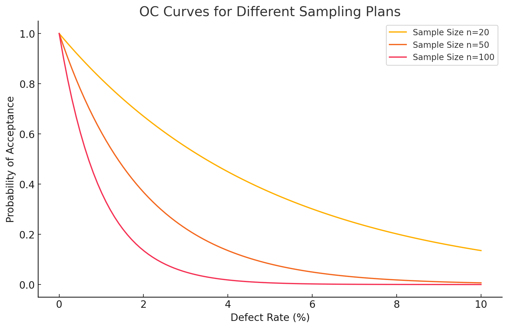
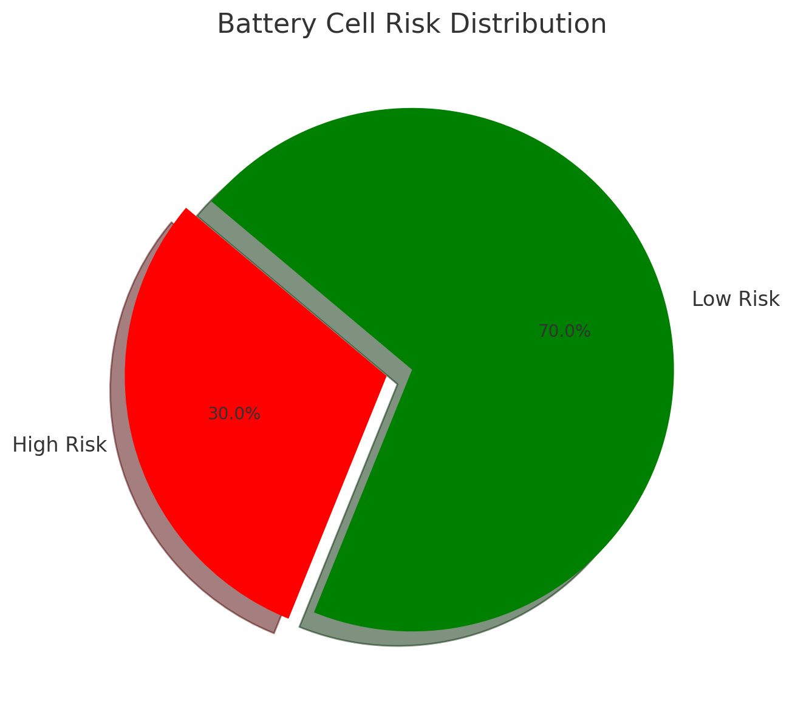
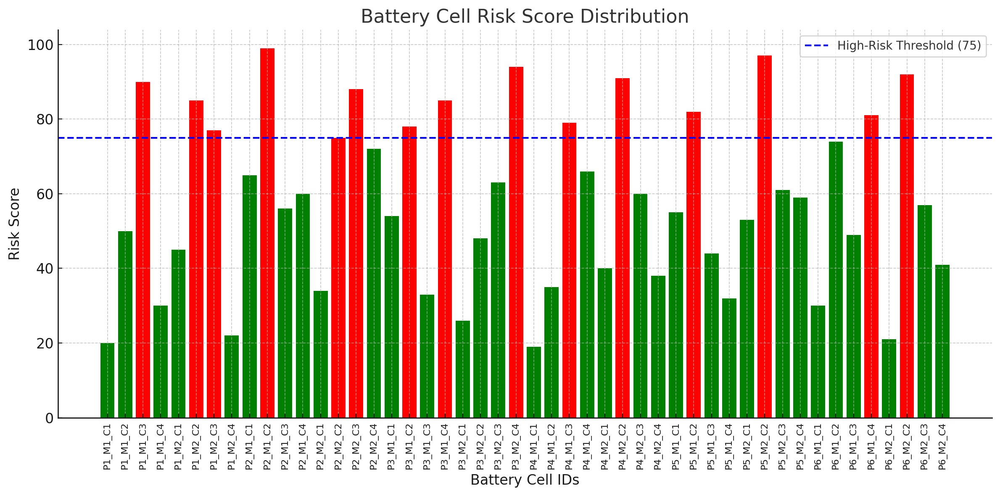
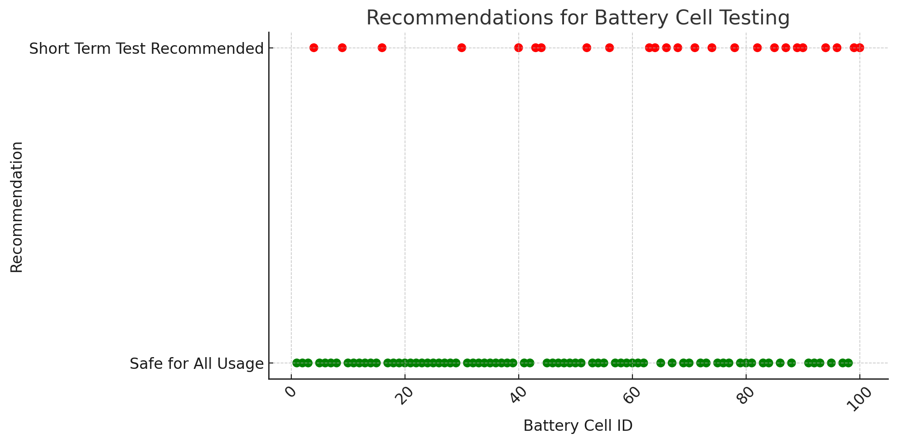

# Quality_APP with MES Integration

## Overview
The **Quality_APP** aims to achieve the following objectives:

1. **Quality Digitalization**: Transform traditional quality control processes by digitalizing quality data, enabling real-time monitoring and predictive analytics.
2. **Online Quality Engineering**: Implement an online system for quality control during production, integrating machine learning models to predict potential defects and recommend corrective actions.
3. **Reliability Prediction During Development Phase**: Utilize predictive analytics to assess the reliability of battery cells during the early stages of development, allowing for proactive adjustments to improve product quality.
4. **Optimization of Incoming Materials and On-Site Sampling Inspection**: Enhance the efficiency of material inspections and sampling processes by leveraging predictive models to identify high-risk batches and adjust inspection protocols accordingly.
5. **Delivery Risk Assessment During Mass Production Stage**: Assess the risk associated with delivering battery cells during the mass production phase by evaluating quality metrics and production data, ensuring high-quality output and timely delivery.

The **Quality_APP** is designed for real-time monitoring and prediction of high and low-risk battery cells in a production line. By utilizing IPQC (In-Process Quality Control), FQC (Final Quality Control), and OQC (Outgoing Quality Control) data, the system predicts the risk associated with battery cells and provides recommendations for further actions:
- **High Risk**: Short-term testing recommended.
- **Low Risk**: Safe for all usage.

The application integrates with a Manufacturing Execution System (MES) to receive production orders and push data for quality analysis, ensuring comprehensive monitoring and control over the battery cell manufacturing process.

## Key Features
- Real-time monitoring of machine operational data (e.g., assembly force, pressure, speed) during battery cell manufacturing.
- Communication with MES to push machine data and fetch production orders.
- Quality control using machine learning models to predict defects.
- Corrective feedback sent to machines based on analysis.
- Dash-based web app for monitoring machine status, production orders, and analysis results.

## Features
- **Real-time Data Collection**: Collects quality control data (IPQC, FQC, OQC) from various stages of production.
- **Risk Prediction**: Machine learning models are used to predict high and low-risk battery cells.
- **Recommendation System**: Provides actionable insights, suggesting testing for high-risk cells and safe usage for low-risk cells.
- **MES Integration**: Communicates with MES via REST API for data exchange (production orders, quality control results).
- **Web Dashboard**: Visualizes production data and risk analysis results, facilitating real-time decision-making.

## Architecture Overview

### Data Sources:
- IPQC, FQC, and OQC data.
- MES API for integrating production orders and reporting quality control data.

### Core Functionality:

- Real-time data collection from machines.
- Analysis using machine learning models (Logistic Regression, XGBoost).
- Feedback loop to adjust machine parameters for quality control.

### Web Interface:

- A Dash-based interface for visualizing machine status and production orders.
- Interval-based updates to reflect the latest data and analysis.

### Requirements

- Python 3.8+
- Dash for web visualization
- Plotly for interactive charts
- Requests for communication with MES API
- scikit-learn for machine learning models
- XGBoost for model training
- MES API Access (replace with your actual MES URL and API token)

## Installation

### Clone the repository:

- `git clone https://github.com/yasirusama61/Quality_APP_MES_Integration.git`
- `cd Quality_APP_MES_Integration`

### Install the required dependencies:
- `pip install -r requirements.txt`

## Usage

### Running the App Locally

Ensure you have your MES API token set up in the environment variables or update the MES_API_URL and HEADERS in the script.

Run the following command to start the app:

- `python app.py`

Access the Dash app in your browser at: `http://127.0.0.1:8050`.

### Running the App in Production

Use Gunicorn or a similar WSGI server for production deployment.

- `gunicorn -b 0.0.0.0:8050 app:app`

Make sure the app is properly configured to interact with the actual production line machines and the MES API.

### Interacting with the Dashboard

- **Machine Monitoring Section**: Displays real-time machine data such as temperature, vibration, speed, and status.
- **Production Orders Section**: Shows active production orders fetched from the MES.
- **Risk Prediction and Recommendation**: Provides real-time predictions of high/low-risk battery cells based on IPQC, FQC, and OQC data, with recommendations on further testing or clearance.

### Integration Details

### Machine Data Fetching
Machine data is simulated in the `get_machine_data()` function. In a real-world environment, replace this with actual data from your PLCs, IoT devices, or sensors.
The data includes critical operational parameters such as temperature, speed, vibration, and machine status.
MES API Communication
The app sends real-time machine data to the MES using `post_machine_data_to_mes()` and retrieves production orders using fetch_production_orders().
You need to replace the placeholder URL `(MES_API_URL)` and API token in the script with actual values for your MES system.

### Machine Learning Models

The `analyze_quality()` function simulates a quality control model to predict potential defects based on machine operating parameters.
You can replace this with actual machine learning models, such as Logistic Regression or XGBoost, trained on your historical production data.

### Feedback to Machines
Based on the results of the quality analysis, corrective feedback is sent to machines via the `send_correction_to_machine()` function.In real-world use cases, this would involve sending signals to the machine's PLC to adjust operating parameters (e.g., speed, temperature).

### Usage

- Run the script in a local environment or deploy it on a server.
- View real-time machine data and production orders from the MES in the Dash web app.
- Analyze machine data for defects using machine learning models, and see the corrective feedback sent to machines.

### Expected Output

### Machine Status:

- **Machine ID**: CAS_01 (Cell Assembly Station)
  - **Temperature**: 45°C
  - **Vibration**: 0.12 m/s²
  - **Speed**: 1000 RPM
  - **Status**: Operating

- **Machine ID**: FORM_01 (Formation Chamber)
  - **Temperature**: 38°C
  - **Current**: 3.5 A
  - **Voltage**: 4.2 V
  - **Status**: Charging

- **Machine ID**: EOL_01 (End-Of-Line Tester)
  - **Temperature**: 40°C
  - **Voltage**: 3.9 V
  - **SOC**: 98%
  - **Status**: Testing

- **Production Orders**:
  - Order 98765: High Capacity Cell - 2000 units
  - Order 98766: Standard Capacity Cell - 1500 units

### Defect Analysis:

- **Defect Predicted**: Yes
- **Corrective Action Sent**: Reduce temperature in CAS_01 to 40°C and adjust current in FORM_01 to 3.2 A.

## Quality Inspection Insights Using MIL-STD-1916

### 1. Understanding AQL and LTPD

The Acceptable Quality Level (AQL) and Lot Tolerance Percent Defective (LTPD) are key metrics in quality control:
- **AQL**: Represents the threshold of acceptable quality for a "good batch." It is commonly set at a producer risk of 5% (α = 5%), meaning there is a 5% chance of rejecting an acceptable batch.
- **LTPD**: Indicates the threshold for an unacceptable "bad batch." It is often set at a consumer risk of 10% (β = 10%), meaning there is a 10% chance of accepting a defective batch.

The following figure shows the AQL and LTPD on the OC curve:

### 2. Operating Characteristic (OC) Curves for Sampling Plans

The OC curve represents the probability of accepting a batch based on its quality level. Different sampling plans impact the shape of the OC curve. The variables include:
- **Batch size (N)**: The total number of items in a batch.
- **Sample size (n)**: The number of items inspected from the batch.
- **Acceptance number (Ac)**: The maximum allowable number of defective items in the sample.

The plot below illustrates OC curves for various batch sizes and sample sizes:

### Insights:
- **Impact of Batch Size (N)**: Larger batch sizes generally result in a steeper OC curve, meaning a clearer distinction between good and bad quality batches.
- **Impact of Sample Size (n)**: Increasing the sample size reduces the probability of accepting a defective batch but requires more inspection effort.
- **Acceptance Criteria (Ac)**: The acceptance criteria affect the likelihood of accepting batches with varying quality levels, balancing consumer and producer risks.

### 3. Sampling Code Comparison

The following table summarizes the sampling codes based on batch size and acceptance criteria:

| Batch Size (N) | Sample Size (n) | Acceptance Number (Ac) |
|----------------|-----------------|------------------------|
| 100            | 20              | 0                      |
| 200            | 20              | 0                      |
| 500            | 50              | 0                      |
| 1000           | 100             | 0                      |

### Application in Quality Control

The MIL-STD-1916 standard is used to optimize the inspection of incoming materials and on-site sampling by:
- Determining appropriate sample sizes and acceptance criteria to balance inspection effort and quality assurance.
- Reducing the risk of accepting defective batches (consumer risk) while minimizing the likelihood of rejecting acceptable batches (producer risk).

These insights and figures align with the project's goal of improving quality control through systematic sampling and inspection procedures.

### Delivery Risk Assessment During Mass Production

The process involves evaluating risks associated with delivering battery cells, modules, or packs during the mass production stage. This assessment relies on comprehensive data collected throughout the production process, along with feedback from various stages of the product lifecycle.

#### Data Sources for Risk Assessment:

1. **Full Process Data for Each Batch (Cells/Modules/Packs):**
   - Includes data from the design, manufacturing process, materials used, and inspection stages.
   - Ensures traceability and provides insights into potential quality issues at each step of production.

2. **Failure Data:**
   - **Pack Side Failure Data:** Failures detected during testing or in the field.
   - **OEM Failure Data:** Issues identified by the original equipment manufacturers (OEMs).

3. **Customer Feedback and After-Sales Data:**
   - **Market Customer Complaint Data:** Insights from customer complaints and feedback.
   - **After-Sales Maintenance Data:** Data related to maintenance activities performed post-sale.
   - **Vehicle Backend System Big Data:** Information collected from vehicle systems that can provide early warnings or trends regarding battery performance issues.

#### Key Insights:
- **0km Data Analysis:** Quality control data before the product hits the market, ensuring issues are detected early.
- **>0km Data Analysis:** Post-market data analysis for ongoing quality monitoring and improvement efforts.

These data sources together form a robust framework for assessing delivery risks, allowing for proactive measures to be taken to ensure quality and minimize defects during mass production.

### Automation and Data Handling Efforts

1. **Shopflow System Daily Yield Automation**: The current status involves automating daily yield calculations, which currently take about 40 minutes every day.
2. **DV2 Battery Cell Data Statistics Automation**: Automating the collection and processing of battery cell data, which currently takes approximately 20 minutes daily.
3. **SPC Data Automation**: Automating Statistical Process Control (SPC) data tasks, reducing manual data handling, which presently takes about 15 minutes per day.
4. **Automated Series Comparison of Key Inspection Data**: Efforts are ongoing to automate comparisons of key inspection data, although the work order history database is still being manually established.

## Results

### Battery Cell Risk Prediction Over Time

### Risk Score Distribution

### Recommendations for Battery Cell Testing

### 1. Recommendations for Battery Cell Testing
The scatter plot indicates battery cells categorized as either "Short Term Test Recommended" or "Safe for All Usage." Cells in the "Short Term Test Recommended" category (shown in red) may require additional testing to ensure quality, while those in the "Safe for All Usage" category (shown in green) have passed the standard quality checks. This approach helps prioritize testing resources and optimize inspection efforts, especially when dealing with a large number of battery cells.

### 2. Battery Cell Risk Distribution
The pie chart illustrates the proportion of high-risk versus low-risk battery cells. Approximately 30% of the cells fall under the high-risk category, while the remaining 70% are considered low-risk. This distribution can guide quality control actions by focusing additional inspections on high-risk cells to reduce potential failures and improve the overall quality of the battery pack.

### 3. Battery Cell Risk Score Distribution
The bar chart displays the risk score distribution for 100 battery cells. The blue dashed line indicates the high-risk threshold (75), above which cells are considered high-risk (shown in red bars). Cells below this threshold (shown in green bars) are deemed low-risk. The variability in risk scores highlights the need for dynamic testing strategies to ensure that high-risk cells undergo further inspection, while low-risk cells can be approved for use more quickly.

These visualizations provide a comprehensive approach to quality control by categorizing cells based on risk, allowing targeted testing to improve production efficiency and ensure the reliability of battery cells.

### Future Enhancements

- **Advanced Machine Learning Models**: Integrate models like Random Forest, Neural Networks, or LSTMs for more robust defect prediction.
- **Data Persistence**: Store machine data and quality analysis results in a database (e.g., PostgreSQL, MongoDB) for further reporting and analytics.
- **Real Machine Data Integration**: Replace the simulated machine data with actual production line data from PLC controllers, IoT devices, or OPC servers.
- **Full MES Integration**: Improve communication with the MES to handle more complex tasks such as job scheduling, downtime tracking, and machine status alerts.