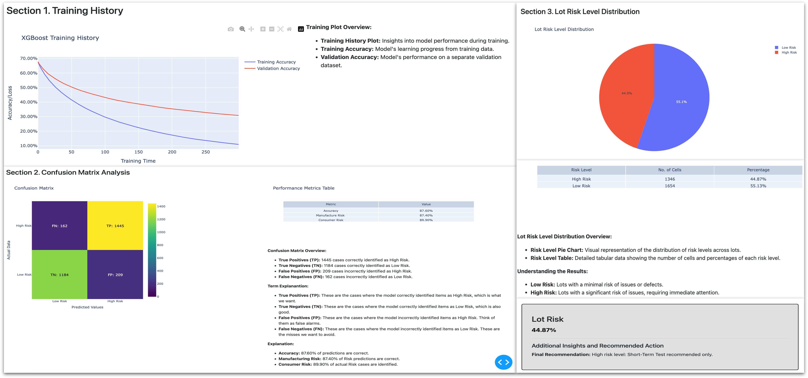
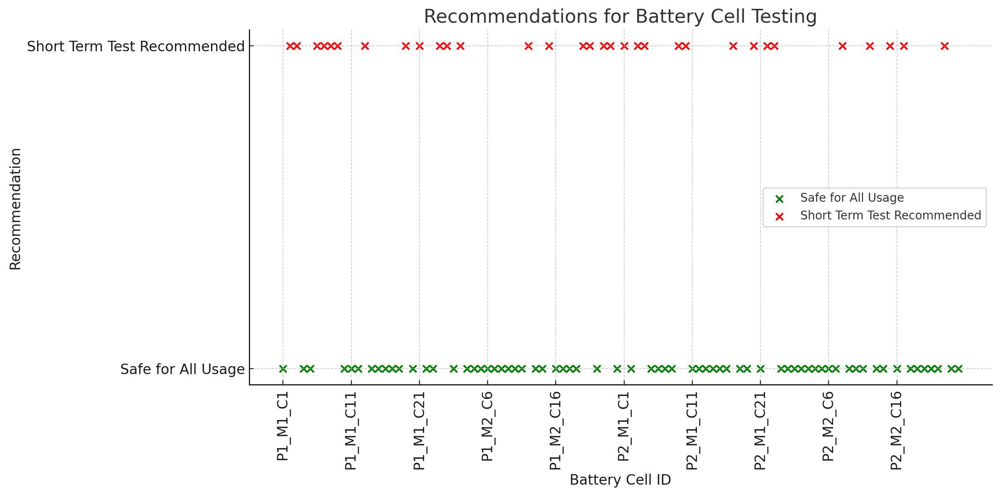

# 🛠️ **Quality_APP with MES Integration**


## 📄 **Overview**
The **Quality_APP** aims to achieve the following objectives:

1. **Quality Digitalization**: Transform traditional quality control processes by digitalizing quality data, enabling real-time monitoring and predictive analytics.
2. **Online Quality Engineering**: Implement an online system for quality control during production, integrating machine learning models to predict potential defects and recommend corrective actions.
3. **Reliability Prediction During Development Phase**: Utilize predictive analytics to assess the reliability of battery cells during early development stages, allowing proactive quality improvements.
4. **Optimization of Incoming Materials and On-Site Sampling Inspection**: Enhance inspection efficiency by identifying high-risk batches and adjusting inspection protocols through predictive models.
5. **Delivery Risk Assessment During Mass Production Stage**: Assess delivery risk in mass production by evaluating quality metrics and production data to ensure high-quality output and timely delivery.

The **Quality_APP** is designed for real-time monitoring and risk prediction in battery cell production lines. Using IPQC, FQC, and OQC data, it classifies risk and provides actionable recommendations:
- **High Risk**: Short-term testing recommended.
- **Low Risk**: Safe for use.

Integrated with a Manufacturing Execution System (MES), the application receives production orders and quality data for analysis, ensuring comprehensive monitoring across the manufacturing process.

Below is a snapshot of the Quality APP Dashboard, showcasing its interface and features for data upload, model execution, real-time quality risk assessment, and report generation.



## 🌟 **Key Features**
- **Real-time Monitoring**: Tracks operational data like assembly force, pressure, and speed during battery manufacturing.
- **MES Integration**: Enables data exchange with MES for production orders and quality control results.
- **Predictive Quality Control**: Uses machine learning models to forecast defects.
- **Corrective Feedback**: Provides feedback for machine adjustments based on model analysis.
- **Web Dashboard**: A Dash-based app for visualizing production data and analysis.

## 🔑 **Features**
- **Real-time Data Collection**: Gathers IPQC, FQC, and OQC data from production stages.
- **Risk Prediction**: Predicts high and low-risk battery cells using machine learning.
- **Recommendation System**: Suggests testing for high-risk cells and safe usage for low-risk cells.
- **MES Integration**: Communicates with MES via REST API for real-time data exchange.
- **Web Dashboard**: Displays production data and risk analysis, aiding real-time decision-making.

## 🏗️ **Architecture Overview**

### 📊 Data Sources:
- Quality control data (IPQC, FQC, OQC).
- MES API for integrating production orders and quality control reports.

### 🧩 Core Functionality:
- **Data Collection**: Real-time data retrieval from manufacturing machines.
- **Model Analysis**: Uses machine learning (Logistic Regression, XGBoost) for quality assessment.
- **Feedback Mechanism**: Provides quality control adjustments to machine parameters.

### 💻 Web Interface:
- **Dashboard**: A Dash-based interface for viewing machine and production data.
- **Real-Time Updates**: Regular data refresh for up-to-date analysis.

## ⚙️ **Requirements**

- **Python 3.8+**
- **Dash**: For web visualization.
- **Plotly**: For interactive charts.
- **Requests**: For API communication with MES.
- **Scikit-learn**: For machine learning models.
- **XGBoost**: For model training.
- **MES API Access**: Configure with actual MES URL and API token.

## 🛠️ **Installation**

### 📥 Clone the repository:

```bash
git clone https://github.com/yasirusama61/Quality_APP_MES_Integration.git
cd Quality_APP_MES_Integration
```

### 📦 Install the required dependencies:
- `pip install -r requirements.txt`

### 🚀 Usage
### 🌐 Running the App Locally

Ensure you have your MES API token set up in the environment variables or update the MES_API_URL and HEADERS in the script.

Run the following command to start the app:

- `python app.py`

Access the Dash app in your browser at: `http://127.0.0.1:8050`.

### 🌍 Running the App in Production

Use Gunicorn or a similar WSGI server for production deployment.


- `gunicorn -b 0.0.0.0:8050 app:app`

Make sure the app is properly configured to interact with the actual production line machines and the MES API.

### 💻 Interacting with the Dashboard

- **Machine Monitoring Section**: Displays real-time machine data such as temperature, vibration, speed, and status.
- **Production Orders Section**: Shows active production orders fetched from the MES.
- **Risk Prediction and Recommendation**: Provides real-time predictions of high/low-risk battery cells based on IPQC, FQC, and OQC data, with recommendations on further testing or clearance.

### 🔗 **Integration Details**

#### 📈 Machine Data Fetching
Machine data is currently simulated within the `get_machine_data()` function. For a real-world application, replace this with actual data from **PLCs**, **IoT devices**, or **sensors**. Key operational parameters include:
- Temperature
- Speed
- Vibration
- Machine Status

#### 🌐 MES API Communication
The app facilitates real-time data exchange with the **Manufacturing Execution System (MES)**:
- Sends machine data using `post_machine_data_to_mes()`
- Retrieves production orders with `fetch_production_orders()`

Replace the placeholder `MES_API_URL` and **API token** in the script with values specific to your MES system.

#### 🧠 Machine Learning Models
The `analyze_quality()` function simulates a quality control model that predicts potential defects based on machine parameters. Replace it with advanced models like **Logistic Regression** or **XGBoost** trained on historical production data for enhanced predictive accuracy.

#### 🔄 Feedback to Machines
Quality analysis results trigger corrective feedback, sent to machines via the `send_correction_to_machine()` function. In a live setup, this would involve transmitting signals to adjust machine parameters (e.g., speed, temperature) based on analysis.

### 🚀 **Usage**

- Run the app in a local environment or deploy on a server.
- Access real-time machine data and MES production orders via the Dash web app.
- Use the app to analyze machine data for defect prediction and receive corrective feedback sent to machines.

### Expected Output

#### Machine Status:

- **Machine ID**: CAS_01 (Cell Assembly Station)
  - **Temperature**: 45°C
  - **Vibration**: 0.12 m/s²
  - **Speed**: 1000 RPM
  - **Status**: Operating

- **Machine ID**: FORM_01 (Formation Chamber)
  - **Temperature**: 38°C
  - **Current**: 3.5 A
  - **Voltage**: 4.2 V
  - **Status**: Charging

- **Machine ID**: EOL_01 (End-Of-Line Tester)
  - **Temperature**: 40°C
  - **Voltage**: 3.9 V
  - **SOC**: 98%
  - **Status**: Testing

- **Production Orders**:
  - Order 98765: High Capacity Cell - 2000 units
  - Order 98766: Standard Capacity Cell - 1500 units

#### Defect Analysis:

- **Defect Predicted**: Yes
- **Corrective Action Sent**: Reduce temperature in CAS_01 to 40°C and adjust current in FORM_01 to 3.2 A.

---

## Quality Inspection Insights Using MIL-STD-1916

### 1. Understanding AQL and LTPD

The Acceptable Quality Level (AQL) and Lot Tolerance Percent Defective (LTPD) are key quality metrics:

- **AQL**: The threshold for acceptable quality, with a 5% producer risk (α = 5%) of rejecting a good batch.
- **LTPD**: The tolerance for an unacceptable batch, with a 10% consumer risk (β = 10%) of accepting a defective batch.


### 2. Operating Characteristic (OC) Curves for Sampling Plans

The OC curve illustrates the likelihood of batch acceptance based on quality levels. Factors include:
- **Batch Size (N)**: Larger batches create a steeper OC curve, enhancing the distinction between quality levels.
- **Sample Size (n)**: Higher sample sizes lower defect acceptance chances but increase inspection requirements.
- **Acceptance Number (Ac)**: Defines the allowable defects in a sample, balancing consumer and producer risks.


**Insights:**
- **Batch Size Impact**: Larger batches offer clearer quality distinctions.
- **Sample Size Impact**: Larger samples reduce defect acceptance but require more effort.
- **Acceptance Criteria**: Adjusting the criteria balances risk and inspection effort.

### 3. Sampling Code Comparison

| Batch Size (N) | Sample Size (n) | Acceptance Number (Ac) |
|----------------|-----------------|------------------------|
| 100            | 20              | 0                      |
| 200            | 20              | 0                      |
| 500            | 50              | 0                      |
| 1000           | 100             | 0                      |

### Application in Quality Control

The MIL-STD-1916 standard optimizes inspection and sampling by:
- Setting sample sizes and acceptance criteria to enhance quality assurance while managing inspection efforts.
- Minimizing consumer risk and balancing producer risk to prevent accepting defective batches or rejecting acceptable ones.

These insights align with the project's objectives, providing a structured approach to quality control through systematic sampling and inspection.

### Delivery Risk Assessment During Mass Production

The delivery risk assessment process evaluates potential risks associated with delivering battery cells, modules, or packs during mass production. This assessment is based on data collected throughout production and feedback from various lifecycle stages.

#### Data Sources for Risk Assessment

1. **Full Process Data for Each Batch (Cells/Modules/Packs):**
   - Data from design, manufacturing, materials, and inspection stages.
   - Ensures traceability and highlights quality issues at each production stage.

2. **Failure Data:**
   - **Pack Side Failure Data:** Failures observed during testing or in the field.
   - **OEM Failure Data:** Issues identified by original equipment manufacturers (OEMs).

3. **Customer Feedback and After-Sales Data:**
   - **Market Customer Complaint Data:** Insights from customer feedback.
   - **After-Sales Maintenance Data:** Maintenance records post-sale.
   - **Vehicle Backend System Big Data:** Data from vehicle systems indicating battery performance trends.

#### Key Insights:
- **0km Data Analysis:** Quality control data before market release, ensuring issues are detected early.
- **>0km Data Analysis:** Post-market data analysis for continued quality monitoring and improvement.

These data sources form a robust framework for assessing delivery risks, enabling proactive measures to ensure quality and reduce defects during mass production.

---

### Automation and Data Handling Efforts

1. **Shopfloor System Daily Yield Automation**: Automating daily yield calculations (currently ~40 mins daily).
2. **DV2 Battery Cell Data Statistics Automation**: Automating data collection (~20 mins daily).
3. **SPC Data Automation**: Automating Statistical Process Control (SPC) data tasks (~15 mins daily).
4. **Automated Series Comparison of Key Inspection Data**: Ongoing work to automate comparisons of key inspection data, though work order history setup is still manual.

---

## Results

### Battery Cell Risk Prediction Over Time


### Risk Score Distribution


### Recommendations for Battery Cell Testing


#### 1. Recommendations for Battery Cell Testing
The scatter plot classifies cells as "Short Term Test Recommended" (red) or "Safe for All Usage" (green). Battery cells are identified using the format `P{Pack}_M{Module}_C{Cell}`, aiding quick identification in production. This approach optimizes testing resources, especially for large-scale production across multiple packs and modules.

#### 2. Battery Cell Risk Distribution
The pie chart shows high-risk (30%) vs. low-risk (70%) cells across packs and modules, with IDs like `P1_M2_C5`. This distribution helps focus quality control on high-risk cells, reducing potential failures and enhancing battery pack quality.

#### 3. Battery Cell Risk Score Distribution
The bar chart illustrates the risk score distribution across 100 cells, identified by `P{Pack}_M{Module}_C{Cell}`. A blue dashed line marks the high-risk threshold (75), with cells above this threshold (red) flagged for further inspection. This dynamic testing strategy improves production efficiency and battery reliability by focusing on high-risk cells.

These visualizations provide a data-driven approach to quality control, categorizing cells by risk to prioritize targeted testing.

---

### Future Enhancements

- **Advanced Machine Learning Models**: Integrate models like Random Forest, Neural Networks, or LSTMs for improved defect prediction.
- **Data Persistence**: Store machine data and quality analysis results in a database (e.g., PostgreSQL, MongoDB) for further reporting and analytics.
- **Enhanced Machine Learning**: Optimize the integration of real production line data from the MES for more accurate insights.
- **Full MES Integration**: Expand MES communication to manage complex tasks like job scheduling, downtime tracking, and machine status alerts.
